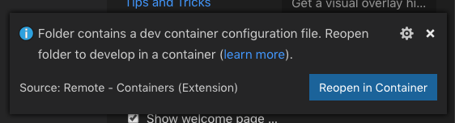
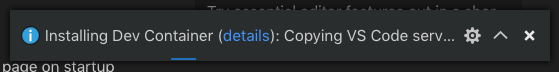
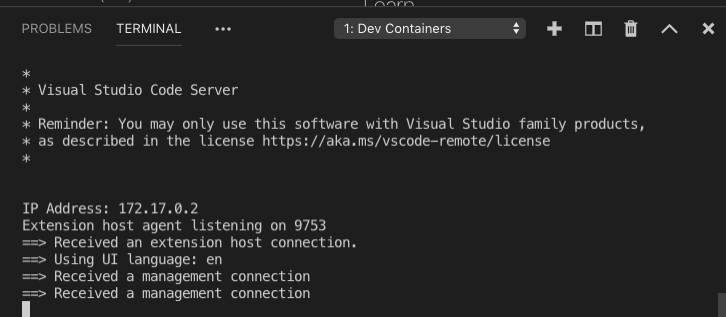
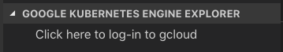

# Cloud Code Guestbook Sample - REMOTE EDITION

This is a quick experiment to see how easily our Cloud Code extension works w/ the newly announced [Remote Development](https://code.visualstudio.com/blogs/2019/05/02/remote-development) Support in VS Code.

## What's the point
This allows a user to fire up a project without having any of the related tool chain on their local PC.  

## Pre-reqs
To get this to work you need:
1. Latest VS Code Insiders 
2. Git (you could download the tar but...)
2. Docker Desktop

however that should be it - no other tools are required on your local machine.

## QuickStart

1. Git clone the repo and open VS Code Insiders
```bash
git clone https://github.com/seanmcbreen/remote-guestbook.git
cd remote-guestbook
code-insiders .
```

2. When promted to re-open as a container say `Reopen in Container`



3. the container will be built and you can see the details but clicking `details`.



When finished it will look like:



4. Log-into GCloud via the Cloud Code GKE explorer (you can also do via CLI and this could be part of the docker file as well).



Follow the prompts in the terminal.

5. you are done - everything e.g. `Continuious Development` and `Cluster Exploration` and `Debugging` should just work.  But remeber none of the rrequired tools for that are on your machine e.g. no `GCloud` or `Kubectl` or even the extension.

## What is in the image
The [dockerfile](https://github.com/seanmcbreen/remote-guestbook/blob/master/.devcontainer/Dockerfile) for the remote development host does a few things.  specifcially it adds in the toolchain required for our project and the extension:

1. Latest `node:lts` image
2. Add the `cloud code` and `docker` extensions
3. Adds `npm`, `typescript` and `tslint`
4. Installs `git`
5. installs `Docker CE`
6. installs `GCloud` and `kubectl`
7. Installs `skaffold`
8. installs `helm`

This takes the requirement away form the user to do any of these things.

## Known issues

* I hard coded my image registry `seanmcb-test` as the default for Skaffold.
* You have to manually log-into `GCloud`
* I hard cocded the version of `GCloud` to get.
